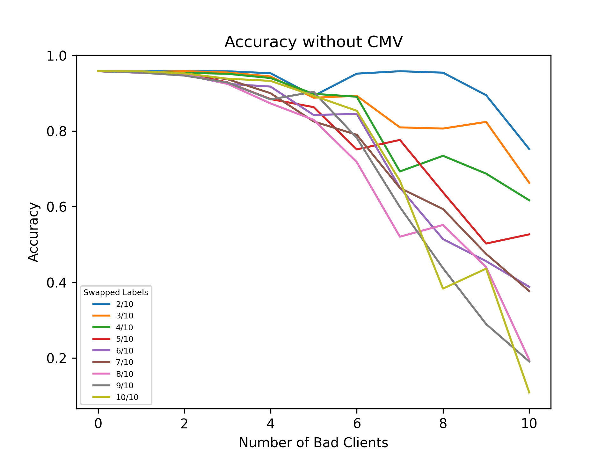
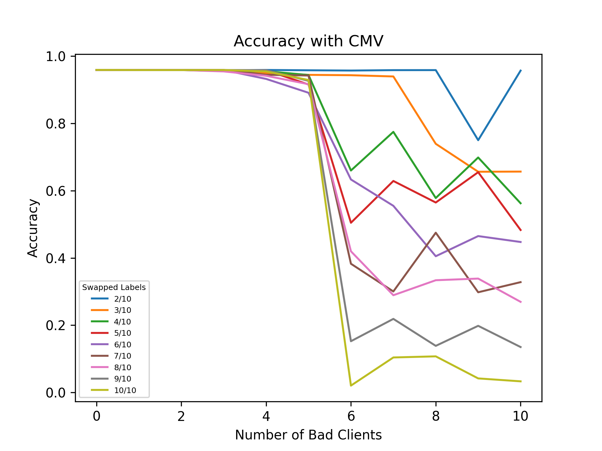
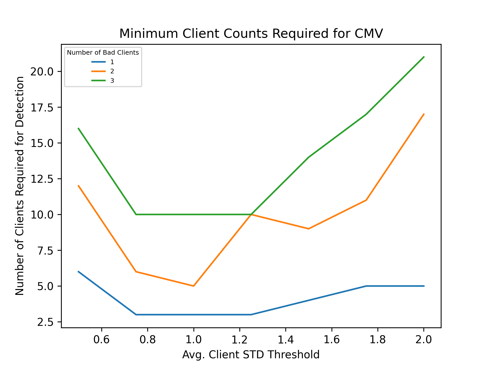

# Client Model Verification for Federated Learning

### Abstract

[To be added later.]

1. [Introduction](#1-introduction)

2. [Methods](#2-methods)

   2.1. [Example](#21-example) 

3. [Results](#3-results)

   3.1. [CMV Performance with Bad Client Models](#31-cmv-performance-with-bad-client-models)

   3.2. [Performance When Bad Client Models Pass CMV](#32-performance-when-bad-client-models-pass-cmv)

   3.3. [CMV Performance over Number of Clients](#33-cmv-performance-over-number-of-clients)

4. [Discussion](#4-discussion)

5. [Conclusion](#5-conclusion)

## 1. Introduction

Federated learning (FL) is a valuable architecture for performing privacy-preserving machine learning with neural networks. The architecture has a one-to-many server-client relationship. The same neural network architecture is initialized on all parties. Each client trains a model using its local dataset. Each then pushes up its trained model to the server, along with the number of examples that were used to train the model. The server then performs a weighted aggregation of the client models. This process results in the global model, which leverages all of the data of all involved clients without revealing the clients' data to the server or to each other. This global model is then pushed out to all clients in the federation, concluding a round of training. The process then repeats.

  
  
Figure 1: The Basic Architecture of Federated Learning

The utility of this architecture is clear: disparate parties are able to collaborate on machine learning models in a way that respects data privacy. However, there are still security risks. A plain FL architecture assumes that both the server and the clients are trustworthy enough to not tamper with the federated learning process.

Existing research addressing this problem focuses on the trustworthiness of the server – that is, how we might minimize the amount of trust we have to place in it. However, existing research largely ignores the problem of assuming the trustworthiness of a federation's clients. There is some research addressing data drift amongst clients, but there is a lack of research addressing malfunctioning or outright malicious clients. The goal of this paper, then, is to address this problem by introducing a method of verifying client models sent to the server.

## 2. Methods

For client model verification (CMV), a statistical method is proposed.

The server is given a test sest to store locally. Before the server begins its weighted aggregation process, it evaluates each client model's accuracy on this test set. The accuracy of each model is then assigned a Z-score relative to the accuracy of all client models.

We then determine the "weight" of each model using the number of training examples it proportionately contributed. We then take the absolute logarithm of these weights with the number of clients as its base. This logarithm, multiplied by the user-supplied average client Z-score threshold, is used as the tolerance for that client model's Z-score. That is, if the accuracy of a given client model differs by more than its tolerable Z-score, then the model is rejected.

Put simply, the more examples a model is trained on, the more strict its verification criteria.

Formally, CMV is defined as follows:

$$
\forall c \in C, V(c) = \text{pass if round(} | \frac{a_c - \mu_A}{\sigma_A} | \text{, 2)} < z_c \text{ else fail}
$$

where

- $C$ is the set of all client models
- $V$ is the verification test
- $A$ is the set of accuracies for each client model
- $Z$ is the set of the maximum allowable Z-scores for each client model

The set $Z$ is calculated as follows:

$$
Z = \{ \forall c \in C, z_c = |\text{ log}_{|C|} \frac{n_c}{\sum n_i} \text{ }| \cdot s \} 
$$

where

- $N$ is the set of the numbers of training examples that were used to train each client
- $s$ is the standard deviation threshold for the average client set by the user
  - This is a hyperparameter (and the *only* hyperparameter)

### 2.1. Example

Let's say there are 10 client models trained on a total of 100,000 examples. Suppose that the first client model was trained on 10,000 examples. Furthermore, suppose the user set the average client standard deviation threshold to 1. Thus,

$$
z_1 = | \text{ log}_{10} \frac{10,000}{100,000} \text{ } | = | \text{ log}_{10} 0.1 \text{ } | = | \text{ } -1 \text{ } | = 1
$$

Now suppose that the accuracy of this model is 0.6, while the average accuracy every other client model is 0.8. Suppose also that the standard deviation of all the accuracies is 0.1. Thus,

$$
V(1) = | \frac{0.6 - 0.8}{0.1} | = | \frac{-0.2}{0.1} | = | -2 | = 2 \not < 1 \rightarrow \text{fail} 
$$

## 3. Results

All experiments below are run on the MNIST dataset using the example CNN provided in the Keras documentation:

https://keras.io/examples/vision/mnist_convnet/

The 60,000 training examples are divided equally among the clients, and each client trains 5 epochs with a batch size of 128.

### 3.1. Comparative Performance of CMV with Bad Client Models

#### **3.1.1 Experiment Design**

To simulate malfunctioning/malicious client models, we will scramble a portion of the training labels in client datasets. We will evaluate the effect these malfunctioning/malicious clients have on performance over two variables:

1. The number of clients that are malfunctioning/malicious.
2. The number of training labels that have been scrambled on a given client.

We will hold the number of total clients constant at 10.

Once we have run these experiments without CMV, we will incorporate CMV and observe how well it preserves performance against malfunctioning/malicious clients. CMV's average client standard deviation threshold will be set to 1.0.

#### **3.1.2. Experiment Results**

  
  
Figure 2: Accuracy over Number of Bad Clients with Different Levels of Scrambling without Client Model Verification

  
  
Figure 3: Accuracy over Number of Bad Clients with Different Levels of Scrambling with Client Model Verification

### 3.2. Minimum Number of Clients for Detecting Different Numbers of Bad Clients

#### 3.2.1. Experiment Design

The more bad clients there are in a given round, the more the distribution of accuracy scores will be skewed toward bad clients. Thus, the more bad clients there are in a given round, the more good clients there must be to skew the distribution "back" toward effectiveness.

We would thus like to determine how many total clients there must be in a federation to detect a given number of bad clients, where each bad client is half-scrambled. For this experiment, we will vary the average client standard deviation threshold, and there will be one line for each number of bad clients that we will test (1, 2, and 3). Each line will thus be plotted as the number of clients over the average client standard deviation threshold.

#### 3.2.2. Experiment Results

  
  
Figure 4: Number of Clients Required to Detect Bad Clients

> Note: A separate test was run to verify that 3 clients are required to detect 1 bad client regardless of how much scrambling has taken place on the bad client. This test is included in the project's GitHub repository and may be replicated there.

## 4. Discussion

### 4.1. Result 1

Result 1 demonstrates that, until the number of bad clients equals or exceeds the number of good clients, CMV is *very* effective at detecting and excluding the bad clients. In Figure 2, we see that performance begins to quickly degrade at 3 bad clients. In Figure 3, though, performance is maintained very well until the bad clients win equality or majority.

Once the number of bad clients equals or exceeds the number of good clients, CMV performance completely degrades, because it then excludes *good* clients. However, at this point, it is no longer reasonable to expect it to detect truly bad clients due to the "majority vote" nature of the test.

### 4.2. Result 2

Result 2 demonstrates an interesting trend. A lower average client standard deviation threshold actually requires *more* total clients to detect bad clients than when using the default of 1.0. This is not so that bad clients may be *excluded*, but so that good clients may be *included*. If there are not sufficient good clients to form a sufficiently "tight" distribution, then most (or even all) clients, don't fall within standard deviations that are close enough to each other.

The minimum number of clients for effective detection comes at the default
value of 1.0.

Once we increase from 1.0, then the number of clients required for bad client detection increases again. This is because, again, a sufficiently "tight" distribution must be formed. This time, though, it must be sufficiently tight such that bad clients are quite distant from the center of the distribution – good clients will certainly be included, but there has to be sufficient "consensus" among them to flag bad clients as exceedingly "far away."

### 4.3. Future Work

Further work on this topic might include the following:

- Performing CMV on client model predictions themselves rather than on performance scores.
  - This has the benefit of exposing CMV to more data overall, and it also does not require that the server's test set be labeled.
- Verifying that clients are sufficiently unbiased for use cases that are known to manifest bias (e.g., loan approval).
- Collecting historic performance for CMV to compare clients against. 

## 5. Conclusion
