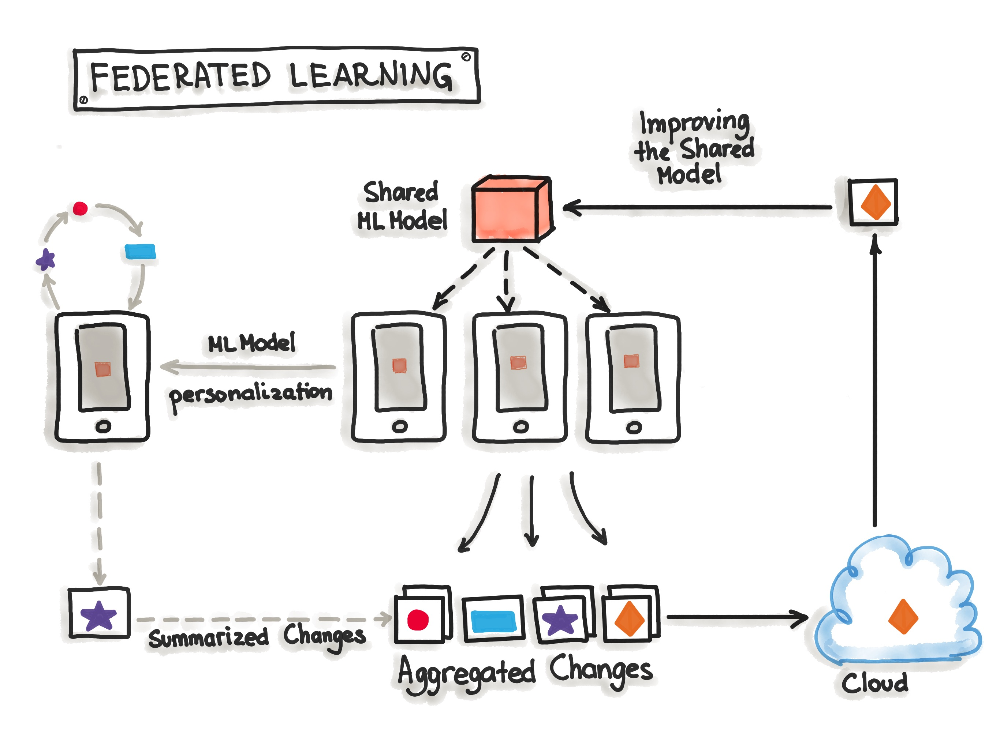

# Client Model Verification for Federated Learning

### Abstract

[To be added later.]

1. [Introduction](#1-introduction)
2. [Methods](#2-methods)
   - [Example](#example) 
3. [Results](#3-results)
4. [Discussion](#4-discussion)
5. [Conclusion](#5-conclusion)

## 1. Introduction

Federated learning (FL) is an invaluable architecture for performing privacy-preserving machine learning with neural networks. The architecture assumes a one-to-many server-client relationship. The same neural network architecture is initialized on all parties. Each client trains a model using its local dataset. They then each push up their trained model to the server, along with the number of examples that were used to train the model. The server then performs a weighted aggregation of the client models. This process results in the global model, which leverages all of the data of all involved clients without revealing the clients' data to the server or to each other. This global model is then pushed out to all clients in the federation, concluding a round of training. The process then repeats.

*Need to replace this with a different diagram.*

The utility of this architecture is clear: disparate parties are able to collaborate on machine learning models in a way that respects data privacy. However, there are still security risks. A plain FL architecture assumes that both the server and the clients are trustworthy enough to not tamper with the federated learning process.

Existing research addressing this problem focuses on the trustworthiness of the server – that is, how we might minimize the amount of trust we have to place in it. However, existing research largely ignores the problem of assuming the trustworthiness of a federation's clients. There is some research addressing data drift amongst clients, but there is a lack of research addressing malfunctioning or outright malicious clients. The goal of this paper, then, is to address this problem by introducing a method of verifying client models sent to the server.

## 2. Methods

To verify client models, a statistical method is proposed.

The clients agree on a test set for the server to store locally. Before the server begins its weighted aggregation process, it evaluates each client model's accuracy on the test set. The accuracy of each model is then assigned a Z-score relative to the accuracy of every other model.

We then calculate the "weight" of each model given how many training examples it proportionately contributed. We then take the absolute log base 10 of these weights. The absolute log base 10 is used as the tolerance for the client model's Z-score. That is, if the accuracy of a given client model is separate by more than its tolerable Z-score, then the model is rejected. In other words, the more training examples a model is trained on, the more strict the verification criteria is for a given model.

*Need to contextualize this diagram.*

> Note: It is reasonable that we trust clients to truthfully report the number of training examples their model was trained on. This is because a malicious client faces a tradeoff when they send a bad model. They could (1) report very few examples such that the statistical test is hardly strict at all, but then have very little influence on the global model or (2) report many examples in an attempt to have more impact on the model, but face a far stricter verification test.

Formally, the verification is as follows:

$$
\forall c \in C, V(c) = \text{pass if } | \frac{a_c - \mu_A}{\sigma_A} | < z_c \text{ else fail}
$$

where

- $C$ is the set of all client models
- $V$ is the verification test
- $A$ is the set of accuracies for each client model
- $Z$ is the set of the maximum allowable Z-scores for each client model

The set $Z$ is calculated as follows:

$$
Z = \{ \forall c \in C, z_c = |\text{ log}_{10} (\frac{n_c}{\sum n_i}) \text{ }| \} 
$$

where

- $N$ is the set of the number of training examples that were used to train each client

It should be clear that this method requires a sufficient number of clients to work effectively, and that it only gets better with scale. Fortunately, real-world federated learning systems are typically deployed at scale.

### Example

Let's say there are 10 client models trained on a total of 100,000 examples. Suppose that the first client model was trained on 10,000 examples. Thus,

$$
z_1 = | \text{ log}_{10} (\frac{10,000}{100,000}) \text{ } | = | \text{ log}_{10} (0.1) \text{ } | = | \text{ } -1 \text{ } | = 1
$$

Now suppose that the accuracy of this model is 0.6, while the average accuracy every other client model is 0.8. Suppose also that the standard deviation of all the accuracies is 0.1. Thus,

$$
V(1) = | \frac{0.6 - 0.8}{0.1} | = | \frac{-0.2}{0.1} | = | -2 | = 2 \not < 1 \rightarrow \text{fail} 
$$

Notice that verification would fail for any accuracy 70% or below in this case. It makes intuitive sense that a model that would contribute 10% to the global model cannot have an accuracy 10% or more below the average.

## 3. Results

Talk about datasets.

Need to quantify performance in experiments and establish metrics.

Need formal definition of experiments/results.

The results are given here as specified in the above section.

Need 2 or 3 results.

## 4. Discussion

## 5. Conclusion
