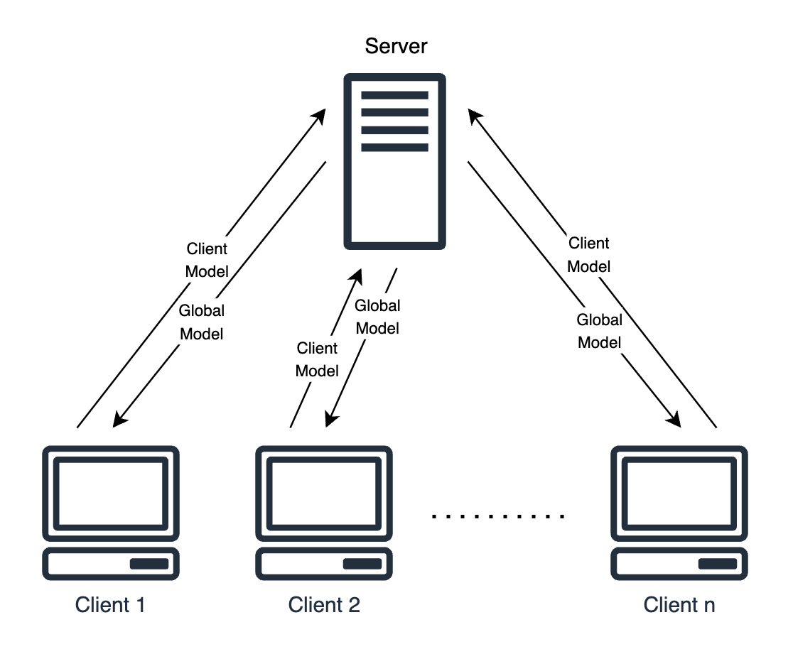

# Client Model Verification for Federated Learning

### Abstract

[To be added later.]

1. [Introduction](#1-introduction)

2. [Methods](#2-methods)

   2.1. [Example](#21-example) 

3. [Results](#3-results)

   3.1. [CMV Performance with Bad Client Models](#31-cmv-performance-with-bad-client-models)

   3.2. [Performance When Bad Client Models Pass CMV](#32-performance-when-bad-client-models-pass-cmv)

   3.3. [CMV Performance over Number of Clients](#33-cmv-performance-over-number-of-clients)

4. [Discussion](#4-discussion)

5. [Conclusion](#5-conclusion)

## 1. Introduction

Federated learning (FL) is a valuable architecture for performing privacy-preserving machine learning with neural networks. The architecture has a one-to-many server-client relationship. The same neural network architecture is initialized on all parties. Each client trains a model using its local dataset. Each then pushes up its trained model to the server, along with the number of examples that were used to train the model. The server then performs a weighted aggregation of the client models. This process results in the global model, which leverages all of the data of all involved clients without revealing the clients' data to the server or to each other. This global model is then pushed out to all clients in the federation, concluding a round of training. The process then repeats.

  

The utility of this architecture is clear: disparate parties are able to collaborate on machine learning models in a way that respects data privacy. However, there are still security risks. A plain FL architecture assumes that both the server and the clients are trustworthy enough to not tamper with the federated learning process.

Existing research addressing this problem focuses on the trustworthiness of the server – that is, how we might minimize the amount of trust we have to place in it. However, existing research largely ignores the problem of assuming the trustworthiness of a federation's clients. There is some research addressing data drift amongst clients, but there is a lack of research addressing malfunctioning or outright malicious clients. The goal of this paper, then, is to address this problem by introducing a method of verifying client models sent to the server.

## 2. Methods

For client model verification (CMV), a statistical method is proposed.

The server is given a test sest to store locally. Before the server begins its weighted aggregation process, it evaluates each client model's accuracy on this test set. The accuracy of each model is then assigned a Z-score relative to the accuracy of all client models.

We then determine the "weight" of each model using the number of training examples it proportionately contributed. We then take the absolute logarithm of these weights with the number of clients as its base. This logarithm, multiplied by the user-supplied average client Z-score threshold, is used as the tolerance for that client model's Z-score. That is, if the accuracy of a given client model differs by more than its tolerable Z-score, then the model is rejected.

Put simply, the more examples a model is trained on, the more strict its verification criteria.

Formally, CMV is defined as follows:

$$
\forall c \in C, V(c) = \text{pass if } | \frac{a_c - \mu_A}{\sigma_A} | < z_c \text{ else fail}
$$

where

- $C$ is the set of all client models
- $V$ is the verification test
- $A$ is the set of accuracies for each client model
- $Z$ is the set of the maximum allowable Z-scores for each client model

The set $Z$ is calculated as follows:

$$
Z = \{ \forall c \in C, z_c = |\text{ log}_{|C|} \frac{n_c}{\sum n_i} \text{ }| \cdot s \} 
$$

where

- $N$ is the set of the numbers of training examples that were used to train each client
- $s$ is the standard deviation threshold for the average client set by the user
  - This is a hyperparameter (and the *only* hyperparameter)

### 2.1. Example

Let's say there are 10 client models trained on a total of 100,000 examples. Suppose that the first client model was trained on 10,000 examples. Furthermore, suppose the user set the average client standard deviation threshold to 1. Thus,

$$
z_1 = | \text{ log}_{10} \frac{10,000}{100,000} \text{ } | = | \text{ log}_{10} 0.1 \text{ } | = | \text{ } -1 \text{ } | = 1
$$

Now suppose that the accuracy of this model is 0.6, while the average accuracy every other client model is 0.8. Suppose also that the standard deviation of all the accuracies is 0.1. Thus,

$$
V(1) = | \frac{0.6 - 0.8}{0.1} | = | \frac{-0.2}{0.1} | = | -2 | = 2 \not < 1 \rightarrow \text{fail} 
$$

## 3. Results

All experiments below are run on the MNIST dataset using the example CNN provided in the Keras documentation:

https://keras.io/examples/vision/mnist_convnet/

### 3.1. CMV Performance with Bad Client Models

To simulate malfunctioning/malicious client models, we will scramble a portion of the training labels in client datasets. We will evaluate the effect these malfunctioning/malicious clients have on performance over two variables:

1. The proportion of clients that are malfunctioning/malicious.
2. The proportion of training labels that have been scrambled on a given client.

We will hold the number of total clients constant at 100. Furthermore, each of these clients will possess 1% of the training data.

Once we have run these experiments, we will incorporate CMV and observe how well it preserves performance against malfunctioning/malicious clients.

### 3.2. Performance When Bad Client Models Pass CMV

Malicious clients *can* circumvent CMV by (1) reporting few enough training examples such that the statistical test on the model is sufficiently lenient and (2) sending a model that is sufficiently accurate, but still performs purposefully below average. However, we would like to be assured that the impact that this has on the global model's performance is minimal.

It is worth noting that, should such impact be minimal, CMV provides sufficient protections for trusting clients to truthfully report the number of examples their models were trained on. This is because a malicious client faces a tradeoff when they send a bad model. They could (1) report very few examples such that the statistical test is hardly strict at all, but then have very little influence on the global model or (2) report many examples in an attempt to have more impact on the model, but face a far stricter verification test.

Suppose that, in a group of $C$ clients, we have 1 client that decides to go rogue. We will determine two things about such a client:

1. How bad of a model can the malicious send
2. How poorly the performance of the global model is affected by this malicious model

### 3.3. CMV Performance over Number of Clients

It is clear that CMV requires a sufficient number of clients to work effectively. Without enough clients, CMV does not have a sufficient sample size for detecting outliers in the set of performance scores. However, we would like to determine *exactly* how many clients are required for CMV to be effective, as well as how much better CMV might perform the more clients are added.

## 4. Discussion

Further work on this topic might include the following:

- Performing CMV on client model predictions themselves rather than on performance scores.
  - This has the benefit of being more granular and not requiring that the server's test set be labeled.
- Verifying that clients are sufficiently unbiased for use cases that are known to manifest bias (e.g., loan approval).
- Collecting historic performance to compare clients against.
  - This could make CMV possible on what is currently too small a number of clients. 

## 5. Conclusion
